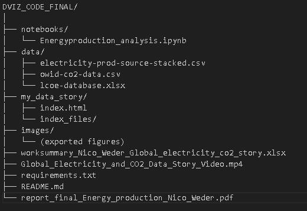

# Global Electricity Transition: Renewables, Fossil Fuels and CO₂ Emissions
*Note for viewing:** This README is written in Markdown. To see it formatted properly:
> - Open it in **VS Code** or another editor with Markdown preview (e.g., Typora, Obsidian, Atom).  
> - In **VS Code**, press `Ctrl+Shift+V` (Windows) or `Cmd+Shift+V` (Mac) to open the Markdown preview.  
> - You can also see the project on **GitHub**(https://github.com/nicoweder/DVIZ_CODE_FINAL) and view the README rendered there.  


## Project Overview

This project analyzes the global electricity transition with a focus on the growing role of renewable energy, its cost competitiveness, and its relationship with CO₂ emissions. Using publicly available datasets, the project explores long-term trends in electricity production, compares renewables and fossil fuels, examines the share of renewables over time, analyzes levelized cost of electricity (LCOE) across technologies, and investigates the relationship between renewable electricity share and CO₂ emissions per capita across countries.

## Questions I wanted to answer with this analysis

- How has global electricity production evolved over time across different energy sources?

- How do renewable and fossil fuel electricity generation compare historically?

- When does the global energy transition become visible in the data?

- How cost-competitive are renewable technologies compared to fossil-based electricity?

- Is there a relationship between renewable electricity share and CO₂ emissions per capita?


## Project Structure 




| Path / File                                                | Description                                                                                    |
| ---------------------------------------------------------- | ---------------------------------------------------------------------------------------------- |
| `notebooks/`                                               | Contains the Jupyter notebook used for all data loading, cleaning, analysis, and visualization |
| `notebooks/Energyproduction_analysis.ipynb`                | Main analysis notebook with all figures used in the project                                    |
| `data/`                                                    | Raw datasets used in the analysis                                                              |
| `data/electricity-prod-source-stacked.csv`                 | Global electricity production by source and country                                            |
| `data/owid-co2-data.csv`                                   | CO₂ emissions data including per-capita emissions                                              |
| `data/lcoe-database.xlsx`                                  | Levelized Cost of Electricity data across technologies                                         |
| `my_data_story/`                                           | Quarto-generated HTML data story                                                               |
| `my_data_story/index.html`                                 | Main interactive HTML visualization output                                                     |
| `my_data_story/index_files/`                               | Automatically generated assets required to display the HTML file correctly                     |
| `images/`                                                  | Exported static images of key visualizations for documentation                                 |
| `worksummary_Nico_Weder_Global_electricity_co2_story.xlsx` | Work summary documenting project progress and timeline                                         |
| `Global_Electricity_and_CO2_Data_Story_Video.mp4`           | Short (≤30s) video demonstrating the project and visualizations                                |
| `requirements.txt`                                         | Python package versions required to reproduce the analysis                                     |
| `README.md`                                                | Project documentation and setup instructions                                                   |
| `report_final_Energy_production_Nico_Weder.pdf`              | Final report to this project                                                   |

## Setup Instructions

1. Create and activate a virtual environment

**Windows:**
```bash
python -m venv .venv
.\.venv\Scripts\activate.
```

**macOS/Linux:**

```bash
python -m venv .venv
source .venv/bin/activate
```

2. Install required packages

```bash
pip install -r requirements.txt
```

## Running the code
To reproduce the analysis, open the notebook in your working environment and run all cells, or execute it from the terminal using Jupyter Notebook:
```bash
jupyter notebook notebooks/Energyproduction_analysis.ipynb
```
## Viewing the HTML Data Story
Open the index.html file in the my_data_story folder by double-clicking it, or launch it from the terminal as shown below.

**Windows:**
```bash
cd my_data_story
start index.html  
```

**macOS:**
```bash
cd my_data_story
open index.html   
```

**Linux:**
```bash
cd my_data_story
xdg-open index.html  
```
If there are no Visualisations, make sure the index_files/ folder is in the same directory as index.html so all assets load correctly.


## Libraries Used
The main libraries used are Pandas, NumPy, Matplotlib, and Seaborn. Additional dependencies like SciPy and statsmodels are installed automatically via these packages.

- pandas – data manipulation and aggregation

- numpy – numerical operations

- matplotlib – base plotting and fine-grained control

- seaborn – make statistical visualizations cleaner 

- openpyxl – reading Excel-based LCOE data

## Author
Nico Weder

Data Visualization Project – Global Electricity & CO₂ Emissions